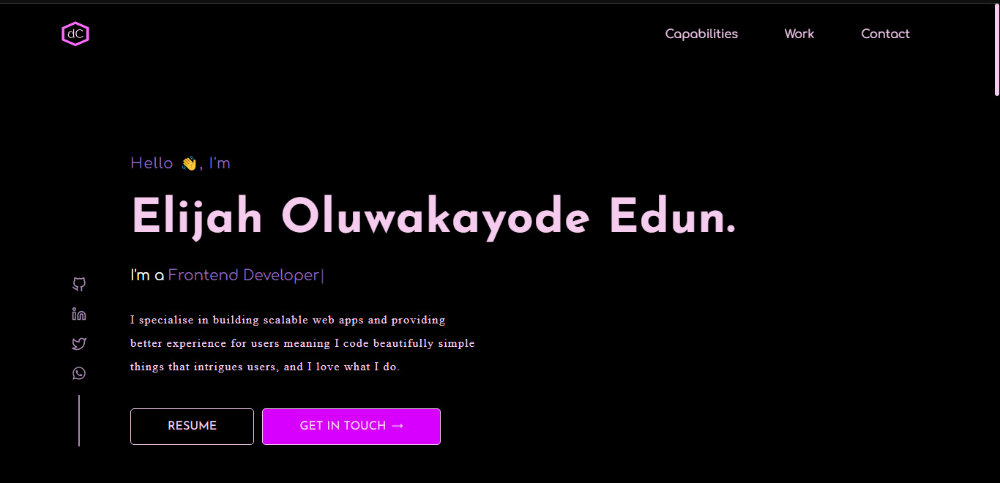

<h1 align="center">Personal Portfolio</h1>

<div align="center">
    This project is built to showcase my work and skills.
</div>

<div align="center">
    <h3>
        <a href="">
            Demo
        </a>
    </h3>
</div>

<!-- TABLE OF CONTENTS -->

## Table of Contents

- [Overview](#overview)
  - [Built With](#built-with)
- [How to use](#how-to-use)

## Overview



### Built With

- [React](https://reactjs.org/)
- [Styled-components](https://styled-components.com/)

## How To Use

<!-- Example: -->

To clone and run this application, you'll need [Git](https://git-scm.com) and [Node.js](https://nodejs.org/en/download/) (which comes with [npm](http://npmjs.com)) installed on your computer. From your command line:

```bash
# Clone this repository
$ git clone https://github.com/your-user-name/your-project-name
# Install dependencies
$ npm install
# Run the app
$ npm start
```